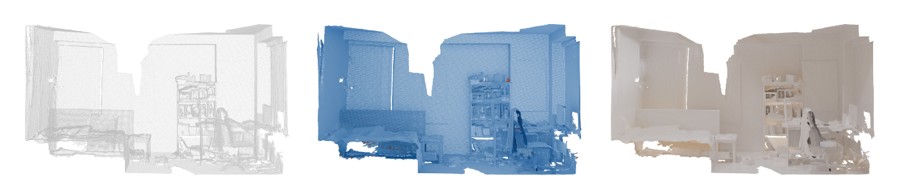

# A Divide-and-Conquer Approach for Global Orientation of Non-Watertight Scene-Level Point Clouds Using 0-1 Integer Optimization(DACPO)

This paper is published at ACM Transactions on Graphics (SIGGRAPH 2025). Please refer to our [paper](https://arxiv.org/abs/2505.23469).



### Tested Platform

- Windows 11
- Visual Studio 2022
- 11th Gen Intel(R)Core(TM)i9-11900K 3.50GHz
- 64GB RAM

### Dependencies
#### For DACPO main project
- PCL
- Open3d
- Eigen
- Boost

**1. PCL**

Install using vcpkg.

`vcpkg install pcl:x64-windows`

`vcpkg integrate project`

After executing `vcpkg integrate project`, you will see a prompt:

> With a project open, go to Tools->NuGet Package Manager->Package Manager Console and paste:
> Install-Package "vcpkg.D.sdk.vcpkg" -Source "{your vcpkg path}"

Follow the instructions as prompted.

**2. Open3D**

Download the Open3D package from [Github releases](https://github.com/isl-org/Open3D/releases), and configure the header files and library files in the solution manager. Link open3d.lib in the linker.

The header files include:

```
include/
include/3dparty 
```
Place the dynamic libraries in the executable file directory.


**3. Eigen**

Install using vcpkg:

`vcpkg install Eigen3:x64-windows`

`vcpkg integrate project`


**4. Boost**

Install using vcpkg:

`vcpkg install boost:x64-windows`

`vcpkg integrate project`


**Build with CMake**

After installing the dependencies, you can build the solution by using the following steps.

1. **Create build directory:**
```bash
mkdir build

cd build

# Using vcpkg toolchain (recommended)
cmake .. -DCMAKE_TOOLCHAIN_FILE=[path_to_vcpkg]/scripts/buildsystems/vcpkg.cmake

# Or use system default
cmake ..
```


**Configure Header and Library Paths**

In all configurations for DACPO main project, set the VC++ directory include paths:

```
include:
src/include
src/include/3dparty
```

#### 0-1 Integer Optimization API
Since DACPO uses gurobi to solve the 0-1 integer optimization problem, you need to start a gurobi service before running the code.
```
cd graphical_model
pip install -r requirements.txt
python socket_server_para.py
```
If you see the following prompt, the gurobi service is running.
```
start comb server
Server listening on 0.0.0.0:11111
```


### Usage
>Note: Before running the code, you need to start the gurobi service following the instructions in the [0-1 Integer Optimization API](#0-1-integer-optimization-api) section.

```
{Path to DACPO.exe} --in {scene name} --iters 0 --depth 10 --neighbors 10 --seed 10 --input_data_root {Path to your scene folder} --ipsr_type 2 --config_folder {Path to conf}
```
Usage:
--in: scene name

--iters: number of iterations

--depth: depth of octree downsampling in each block.-1 means no downsampling

--neighbors: number of neighbors in knn graph

--seed: random seed

--input_data_root: path to scene folder

--ipsr_type: 0: ipsr the whole scene, 2: ipsr each block

--config_folder: path to conf folder, please use /conf/default


### Dataset
Our code can process a single scene in a single ply file.
Batch preprocess dataset and batch running code will be released later.

#### ScanNet
Please refer to [ScanNet](https://github.com/ScanNet/ScanNet)

#### SceneNN
Please refer to [SceneNN](https://github.com/zhaoyu-zhao/SceneNN)


### Citation

If you find this work useful in your research, please consider citing:

```bibtex
@misc{li2025divideandconquerapproachglobalorientation,
      title={A Divide-and-Conquer Approach for Global Orientation of Non-Watertight Scene-Level Point Clouds Using 0-1 Integer Optimization}, 
      author={Zhuodong Li and Fei Hou and Wencheng Wang and Xuequan Lu and Ying He},
      year={2025},
      eprint={2505.23469},
      archivePrefix={arXiv},
      primaryClass={cs.CV},
      url={https://arxiv.org/abs/2505.23469}, 
}
```

